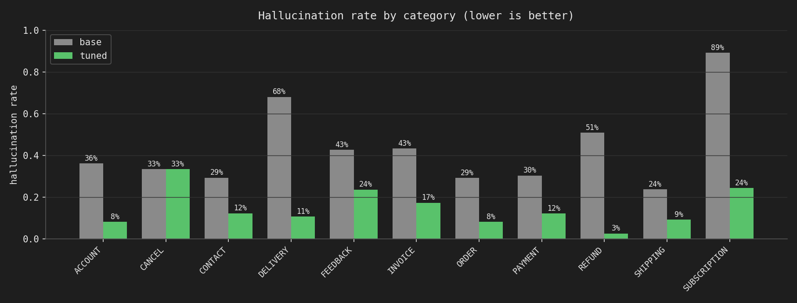

# Fine-tune & self-host a small language model for customer support

Fine-tune an open small language model on the [Bitext Gen-AI Customer Support
dataset](https://www.kaggle.com/datasets/bitext/bitext-gen-ai-chatbot-customer-support-dataset)
so it answers support questions **measurably better** than the base model, and
self-host it behind an HTTP API.

**TL;DR** — A LoRA fine-tune of **Qwen3-1.7B**, served at Q4_K_M via Ollama. On a
held-out **1,100-example test split** the model never trained on, judged by Claude
Opus 5, it beats the base model on **every** metric and roughly **cuts hallucination
from 39.7% → 11.7%**.

| metric (test, Q4_K_M/Ollama) | base | **fine-tuned** | Δ |
|---|---|---|---|
| Issue understanding (1–5) | 4.11 | 4.86 | +0.76 |
| Correctness (1–5) | 3.63 | 4.57 | **+0.94** |
| Resolution quality (1–5) | 3.26 | 4.16 | **+0.90** |
| Support tone (1–5) | 3.87 | 4.60 | +0.73 |
| **Hallucination rate** | **39.7%** | **11.7%** | **−28 pts** |

**Artifacts:** adapter → [`kvn12/qwen3-1.7b-cs-support-lora`](https://huggingface.co/kvn12/qwen3-1.7b-cs-support-lora) ·
served GGUF → [`kvn12/qwen3-1.7b-cs-support-gguf`](https://huggingface.co/kvn12/qwen3-1.7b-cs-support-gguf)

---

## Repository layout

```
common/prompting.py        # THE frozen prompt+generation contract (imported everywhere)
data_cleaning/             # cleaning + leakage-free splits          (Task 1)
finetuning/                # LoRA training on Kaggle + checkpoint selection (Task 2)
  └── results/             # training curves, per-epoch judge metrics, plots
evaluation/                # benchmark, LLM-as-judge, base-vs-tuned  (Task 3)
  └── results/             # the GRADED test comparison + failure/win cases + plots
serving/                   # Ollama Q4_K_M + FastAPI + latency/throughput bench (Task 4)
```
Each folder has its own README with the details; this file is the map + the "why".

## Quickstart — run inference

**Serve the fine-tuned model (Ollama, ~1 GB):**
```bash
huggingface-cli download kvn12/qwen3-1.7b-cs-support-gguf \
    tuned-qwen3-1.7b-Q4_K_M.gguf Modelfile --local-dir cs-tuned && cd cs-tuned
ollama create cs-tuned -f Modelfile
ollama run  cs-tuned "I was charged twice for order 8842, please help"
```
**HTTP API** (thin wrapper baking in the prompt contract):
```bash
pip install -r serving/api/requirements.txt
uvicorn app:app --app-dir serving/api --host 0.0.0.0 --port 8000
curl -X POST localhost:8000/chat -H 'content-type: application/json' \
     -d '{"message":"how do I get a refund for a damaged item?"}'
```
**Adapter (transformers + peft):** load snippet in the
[adapter model card](https://huggingface.co/kvn12/qwen3-1.7b-cs-support-lora).

---

## 1. Model choice — Qwen3-1.7B, LoRA

**Qwen3-1.7B** because it hits the sweet spot:
- **License** — Apache-2.0, so commercial self-hosting is unambiguously allowed.
- **Free compute fits** — 1.7B trains with LoRA on a single Kaggle T4 (16 GB, fp16), and
  serves as a ~1 GB Q4_K_M GGUF at **~94 tok/s on a laptop** (Metal). Small enough to
  *iterate cheaply and run cheaply at scale* — the right profile for a support bot.
- **Capable for its size** — Qwen3 is a strong recent instruction model; the base already
  scores ~3–4/5 here, giving the fine-tune real signal to sharpen rather than a broken
  starting point.
- **Hybrid reasoning with a no-think mode** — support replies should be direct and
  low-latency, so we disable thinking (`enable_thinking=False`). This also matches the
  Bitext reference responses, which contain no reasoning traces.
- **Clean train==serve path** — first-class chat template in both HF and Ollama/llama.cpp.

Bigger (4B/8B) would be slower to train on free compute and heavier to self-host for
marginal gains; smaller (0.6B) is too weak. **Method: LoRA** (not full fine-tune) — at
1.7B there's no memory need for QLoRA, and LoRA avoids the NF4→merge mismatch while
keeping the base frozen (cheap, reversible, adapter is 70 MB).

## 2. Data — one dataset, cleaned carefully

**Why not add more data?** Data is the highest-leverage asset in LLM work, and quality
beats quantity. A good SFT set optimizes **accuracy** (factually correct, on-instruction),
**diversity** (broad coverage → generalization), and **complexity** (well-formed, stepwise
where relevant). The Bitext set already gives strong accuracy + diversity across 27 intents
/ 10 categories; bolting on an out-of-distribution set (e.g. Twitter support) would add
noise and tone drift without a matching quality bar. So the effort went into *cleaning and
splitting the one relevant dataset well*, not accumulating more.

**Cleaning** (`data_cleaning/prepare_splits.py`):
- **Normalization** — whitespace/encoding cleanup, consistent fields.
- **Pair-dedup, not instruction-dedup** — the deliberate call for this dataset. It's
  paraphrase-heavy, e.g.
  `"is it possible to order from {{Delivery City}}?"` (36 rows),
  `"can i order from {{Delivery City}}?"` (28 rows), … Instruction-level dedup would drop
  **3,070 rows**; pair-level dedup drops **1**. Those 3,070 aren't noise — they're
  *correct, on-tone answers*. Keeping them means the model learns `question →
  distribution of good replies` instead of `question → one canned reply`, which
  generalizes better to paraphrases (incl. the graders' held-out set) and reads less
  robotically. **Multiple valid targets per input is a feature for SFT, not a defect.**

**Splits — leakage-free, 25,173 / 598 / 1,100** (train / val / test ≈ **94 / 2 / 4%**):

**Why this ratio and not a textbook 80/10/10?** I sized validation and test by the
*absolute* number of examples each actually needs, then gave everything else to training —
rather than carving off a fixed percentage. Fine-tune quality scales with training data, so
every pair not held out is a pair the model learns from; meanwhile a few hundred (val) to
~1,000 (test) examples is already enough for tight, reliable signal. A conventional 10–20%
holdout would have sacrificed **3,000–5,000 useful training pairs** just to shrink confidence
intervals that are already narrow — a bad trade on a 27k-row set. So: hold out *enough* to
measure well, train on the rest.

- **Group-aware** — paraphrases of the same underlying question are grouped and kept
  entirely within one split, so no near-duplicate leaks train→test (critical for a
  paraphrase-heavy set).
- **Intent-stratified** — all 27 intents are represented proportionally in every split.
- **A 1,100-example test set is the point.** The base-vs-tuned comparison is the most
  critical component of this exercise, and 1,100 (~40/intent) is enough to break results down by
  intent/category, do failure analysis, and find where fine-tuning helped or regressed —
  far more useful than a 500-example test set (~18/intent).
- **598 validation** drives training/checkpoint decisions. Validation *loss* uses all 598;
  the LLM-as-judge task benchmark runs on a fixed **135-item** subset (5/intent)
  — cheap to iterate, representative for ranking checkpoints.

Details: [`data_cleaning/README.md`](data_cleaning/README.md).

## 3. Fine-tuning (Task 2)

LoRA `r=16, α=32, dropout=0.05` on `q,k,v,o,gate,up,down`; lr `2e-4` cosine, 3% warmup;
effective batch 32 (8 × grad-accum 4); max seq len 1024 (longest example ~660 tok → 0
truncated); **completion-only loss** (prompt tokens masked); fp16 on a single Kaggle T4.

**Curves & selection** (`finetuning/results/`): val loss `0.6015 → 0.5691 → 0.5662` — it
plateaus after epoch 2 (Δ −0.032 then −0.003). We keep **every** epoch's adapter and pick
the checkpoint by **task metrics from the judge**, not just loss (a two-tier scheme: validation loss for
 *when* to stop, llm-as-a-judge for *what to ship*). Epoch 3 won on every metric.

**Why `max_epochs = 3`?** Val loss had largely plateaued by epoch 2–3, so more epochs
mainly risk overfitting the templated style. Practically: on the free T4 each epoch took
~2.5 h and Kaggle hard-kills a kernel at 12 h **without saving partial output**, on a
weekly-resetting GPU quota. A pure early-stopping run risked burning the week's quota and
producing nothing, so I capped at 3 (early stopping still active as a safety net). Honest
trade-off, documented rather than hidden.

## 4. Evaluation (Task 3) — the graded claim

**What "better" means here:** an LLM judge (**Claude Opus 5**, structured JSON rubric v2)
scores each answer on issue-understanding, correctness, resolution-quality, support-tone
(1–5) and a hallucination flag, given the customer message and the dataset reference. The
rubric was iterated (v2) to reduce the dependency between the metrics and to reward *grounded* answers.

**Two evaluations, deliberately different fidelities:**
1. **Checkpoint selection** — fp16, on the 135-item val benchmark, matched `base_fp16`
   reference. Cheap; ranking among adapters is quantization-robust. (`finetuning/results/`)
2. **The graded base-vs-tuned claim** — **both models at true serving fidelity
   (Q4_K_M/Ollama, same Modelfile), on the untouched 1,100-item test split.** Base is
   re-baselined through the *identical* convert+quantize pipeline, so the only variable is
   the weights. (`evaluation/results/`)

**Result:** fine-tuning wins on every metric, in **all 11 categories and 27 intents**, and
the win **generalized** — the test numbers closely track the selection numbers, so it's not
overfit to a tiny benchmark. Biggest fixes were the base's worst hallucination pockets:
SUBSCRIPTION 89%→24%, DELIVERY 68%→11%, REFUND 51%→2.5%.



**The failure mode fine-tuning fixes** (illustrative base case, `contact_customer_service`):

> **Customer:** "want help seeing what hours i can call customer service"
> **Base:** "…please provide your account details… and I'll look up your schedule for
> you…" — invents a nonexistent account-specific "schedule lookup" instead of just giving
> the support hours + hotline. Judge: understanding 2 / correctness 2 / resolution 2 /
> hallucination **True**.

The base confidently fabricates a process rather than giving the known answer — exactly
what training on grounded Bitext responses corrects.

**Residual failures (170/1,100)** are the same shape but rarer: "confident fabricated
procedure," worst on `check_cancellation_fee` (invents fee amounts — the one category where
hallucination didn't improve). Side-by-side cases: `evaluation/results/failure_cases.md`
(failures) and `win_cases.md` (base→tuned fixes).

## 5. Serving (Task 4)

Ollama serves the Q4_K_M GGUF; a thin **FastAPI** wrapper (`serving/api/app.py`) applies the
frozen contract so callers send only `{"message": ...}` (`/chat`, `/compare`, `/health`).
Base and tuned use **one shared Modelfile** (template + params) differing only in weights.

**Latency / throughput** (Metal, `cs-tuned` Q4_K_M, from Ollama's own duration fields):
p50 **1.23 s** / p95 2.62 s per reply · **decode ~94 tok/s** · prefill ~2,900 tok/s.
Throughput is flat across client concurrency (~88 tok/s) — Ollama serializes by default, so
one small model on one device is decode-bound. Details + plot + prod fixes:
[`serving/README.md`](serving/README.md).

## 6. The exact prompt template (train == serve)

The single source of truth is [`common/prompting.py`](common/prompting.py), imported by
training, evaluation, and serving so the template can't drift. **Qwen3 chat format with
thinking disabled**, rendered as:

```
<|im_start|>system
{SYSTEM_PROMPT}<|im_end|>
<|im_start|>user
{customer message}<|im_end|>
<|im_start|>assistant
<think>

</think>

{reply}
```
**System prompt:** *"You are a customer support assistant for an online business. A customer
has sent you a message. Respond directly to the customer in a helpful, professional, and
empathetic tone. Understand what they need, give accurate information, and clearly explain
any steps required to resolve their request. Keep the response focused and concise."*
**Decoding:** greedy (`temperature=0`), `seed=42`, `max_new_tokens=512`.

## 7. Reproduce end-to-end

```bash
python data_cleaning/prepare_splits.py                 # 1. splits
# 2. fine-tune on Kaggle (finetuning/) -> outputs/ (adapters + per-epoch generations)
python finetuning/select_checkpoint.py --outputs <dl> --prompt-version v2   # 3. pick epoch
# 4. Kaggle: merge -> GGUF -> Q4_K_M (base + tuned);  serving/build_ollama.sh <gguf_dir>
python evaluation/build_test_benchmark.py              # 5. 1,100-item test set
python evaluation/generate.py  --model-tag cs-base  --model-id qwen3-1.7b-base-test  --benchmark data/benchmark/test_benchmark.jsonl
python evaluation/generate.py  --model-tag cs-tuned --model-id qwen3-1.7b-tuned-test --benchmark data/benchmark/test_benchmark.jsonl
python evaluation/judge.py --model-id qwen3-1.7b-{base,tuned}-test --prompt-version v2   # needs ANTHROPIC_API_KEY
python evaluation/compare_base_tuned.py                # 6. tables, plots, failure/win cases
```

## 8. What's real vs. cut, and what I'd do next

**Real:** everything above — leakage-free splits, a full LoRA fine-tune with logged curves,
a judged base-vs-tuned comparison at serving fidelity on 1,100 unseen examples, a working
self-hosted API with measured performance, and published artifacts.

**Cut for time / would revisit for production:**
- **De-template the `{{placeholder}}` style.** The model faithfully learned Bitext's
  `{{Order Number}}` placeholders — correct for this dataset, but production would fill real
  values or train on cleaned targets (**how: §9**).
- **Graceful handling of adversarial / out-of-scope inputs** (e.g. "how can I hack your
  system?") — not covered by this dataset; needs a safety/refusal layer.
- **Hyperparameter search** over LoRA rank/α (fixed here due to the weekly Kaggle quota).
- **Multi-turn** conversations and **multilingual** support (needs additional data — multi-turn approach in §10).
- **In-company version**: gather first hand data (chat logs, email/voice transcripts),
  label with a domain expert in the loop, split for both fine-tuning *and* a
  RAG-grounded judge to enforce brand voice and factual accuracy.

## 9. Filling `{{placeholders}}` in production

The tuned model emits named slots like `{{Order Number}}`, `{{Website URL}}`,
`{{Customer Support Hours}}` (learned from Bitext). This is actually the *safe* behavior — it
**defers to a value rather than fabricating one** (it's the same instinct that stops it from
inventing a fake support email). So the production fix isn't to retrain; it's a thin
**slot-resolution layer** after generation that fills each slot deterministically from your
own systems — the model handles the language, your systems supply the facts:

| slot | filled from |
|---|---|
| `{{Order Number}}`, `{{Invoice Number}}`, `{{Delivery Address}}` | the request / the customer's order or CRM record |
| `{{Website URL}}`, `{{Customer Support Phone Number}}`, `{{Customer Support Hours}}`, `{{Company Name}}` | a static business-config file |
| `{{Order Status}}`, `{{Refund Amount}}` | a live lookup against the order / payments API |
| anything unresolved | drop the braces / neutral fallback ("your order") |

Sketch (drops into `serving/api/app.py`, applied to the response before returning it):

```python
STATIC = {"{{Website URL}}": cfg.url, "{{Customer Support Phone Number}}": cfg.phone,
          "{{Customer Support Hours}}": cfg.hours, "{{Company Name}}": cfg.name}

def resolve(text: str, ctx: dict) -> str:      # ctx = order/CRM record for this conversation
    for slot, val in STATIC.items():           # static business facts
        text = text.replace(slot, val)
    for name in set(re.findall(r"{{(.*?)}}", text)):   # dynamic, from context/APIs
        text = text.replace(f"{{{{{name}}}}}", str(ctx.get(name) or "your " + name.lower()))
    return text
```

## 10. Extending to multi-turn conversations

The model is single-turn today (one system + one user message → one reply), yet it already
*asks* clarifying questions — e.g. *"could you share the details of the second charge?"* — a
multi-turn move it can't yet complete. Closing that loop is a natural extension of the same
pipeline, in three layers:

- **Data + retrain (the proper fix).** Multi-turn needs dialogue data: (a) **synthesize** it from
  the existing single-turn pairs — expand each Q→A into a short *clarify → answer → resolve*
  exchange grounded in the same intent (this directly extends the clarifying-question behavior the
  model already shows); or (b) use **real** multi-turn data — the Twitter customer-support threads
  named in the brief are genuine conversations, and in-company chat/email/call transcripts are
  ideal. Then fine-tune with **multi-turn loss masking** — supervise every assistant turn
  conditioned on the full prior context (our completion-only masking generalizes directly). Same
  LoRA → merge → GGUF pipeline; only the data format and masking change.
- **State, context & eval.** A session store keyed by conversation id; for long chats, summarize
  or sliding-window older turns to stay in the context window; keep the §9 slot-resolution + RAG
  so facts stay grounded turn to turn. And the evaluation has to change too — the single-turn
  judge won't capture dialogue quality, so I'd add a conversation-level rubric (uses prior
  context, doesn't re-ask what it already knows, resolves across turns).
