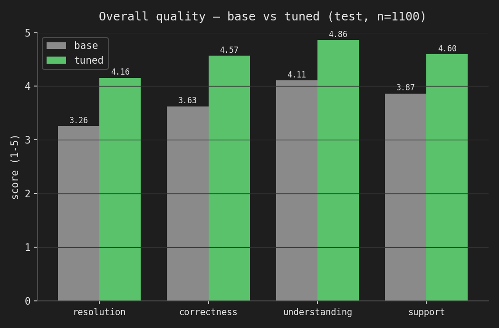
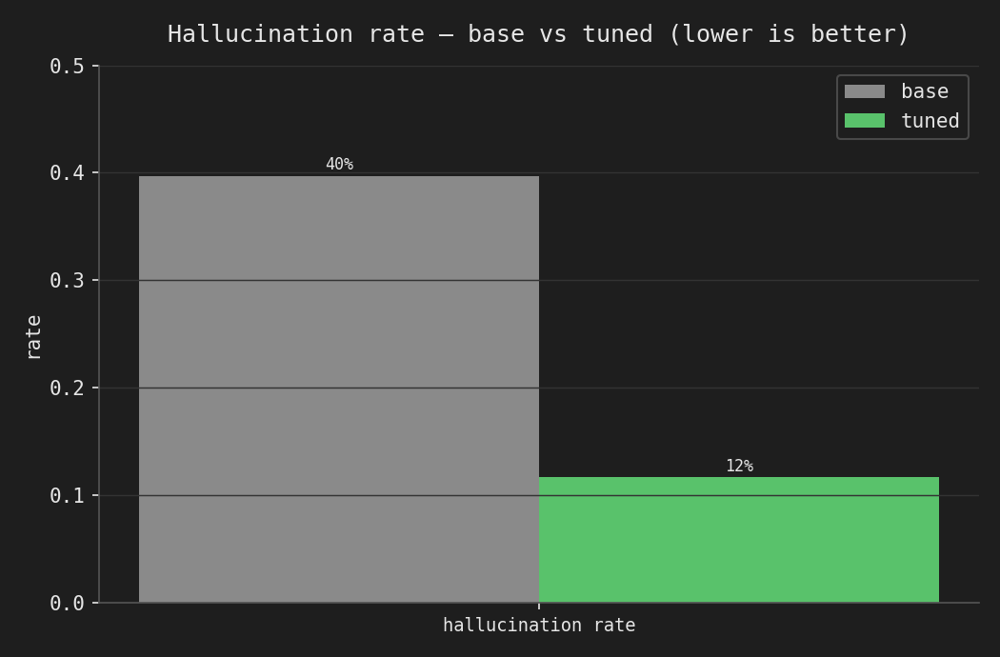
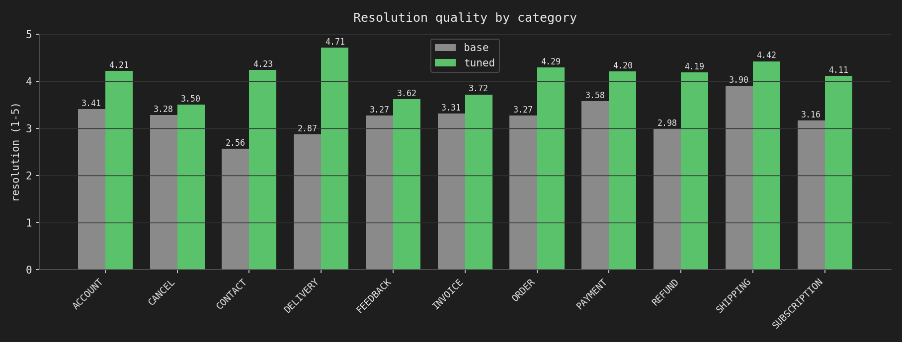

# Final evaluation — base vs. fine-tuned (graded claim)

The honest, leakage-free comparison a skeptical engineer should look at. Both
models are the **same served artifact fidelity** — Qwen3-1.7B, **Q4_K_M GGUF via
Ollama**, built through one identical convert+quantize pipeline, served with the
**same Modelfile** (only the weights differ) — evaluated on the **untouched
1,100-item test split** the model never trained on, judged by **Claude Opus 5**
with the v2 rubric.

## Headline

| metric (mean, 1–5) | base | **tuned** | Δ |
|---|---|---|---|
| Issue understanding | 4.11 | **4.86** | +0.76 |
| Correctness | 3.63 | **4.57** | **+0.94** |
| Resolution quality | 3.26 | **4.16** | **+0.90** |
| Support tone | 3.87 | **4.60** | +0.73 |
| **Hallucination rate** | **39.7%** | **11.7%** | **−28.0 pts (≈ −70% relative)** |

The fine-tuned model is better on **every** metric, in **all 11 categories and all
27 intents**, and cuts the hallucination rate — the most important axis for a
support bot — by roughly 70% relative.




## Why this is trustworthy

- **Serving fidelity, not lab fidelity.** The numbers come from the exact artifact
  we serve (Q4_K_M/Ollama), not fp16 in a notebook. Base is re-baselined through the
  *same* pipeline, so the only variable is the weights.
- **It generalized.** These test numbers track the fp16/val-benchmark *selection*
  numbers closely (resolution base 3.19→3.26, tuned 4.33→4.16; hallucination base
  38.5→39.7%, tuned 8.2→11.7%). No overfitting to the small selection set — the win
  holds on 1,100 fresh queries.
- **Broad, not cherry-picked.** 471/1,100 items are clear wins (base hallucinated →
  tuned didn't, or resolution jumped ≥2). The biggest base failure pockets were fixed
  hardest: SUBSCRIPTION 89%→24%, DELIVERY 68%→11%, REFUND 51%→2.5%.




## Where the tuned model still fails (170 / 1,100)

The residual failure mode is **confident fabricated procedure**: the model invents a
plausible self-service flow or policy specific that isn't supported by the request or
reference. Fine-tuning on Bitext's step-by-step style *amplified* this pattern — it is
now more fluent and structured, which sometimes makes a wrong answer *more* convincing.

- **`check_cancellation_fee` / CANCEL** — the one category where hallucination did **not**
  improve (33% → 33%): the model makes up specific cancellation-fee amounts/policy.
- **`change_order`** — invents an "Update Order" UI flow when the reference says to
  contact support (see `failure_cases.md`, `test-0049`).
- **`review` (44%)**, **`newsletter_subscription` (24%)**, **`delete_account` (23%)**,
  **`get_invoice` (22%)** — highest residual hallucination intents.

See `failure_cases.md` (side-by-side) and `win_cases.md` (base fixed by tuning).

## Caveats / trade-offs (kept explicit)

- **`{{placeholder}}` style.** The tuned model reproduces Bitext's `{{Order Number}}` /
  `{{Website URL}}` placeholders (the training + reference style). That's aligned with
  the task as defined and how the judge scores, but in production you'd de-template the
  training data or post-process placeholders with real values.
- **LLM-as-judge.** Metrics are Opus-5 judgments against the Bitext reference, not human
  ratings. The v2 rubric was designed to reduce halo effects and reward grounded answers;
  still, it is a model's opinion. It is applied identically to base and tuned, so the
  *comparison* is fair even if absolute scores carry judge bias.
- **Greedy, single-sample.** temp=0, seed=42, 512 max-new-tokens for both — reproducible,
  but doesn't probe sampling variance.

## Folder contents

```
evaluation/results/
├── README.md                     # this report
├── data/comparison.json          # overall + per-category base/tuned/Δ
├── plots/
│   ├── overall_quality.png       ├── resolution_by_category.png
│   ├── overall_hallucination.png └── hallucination_by_category.png
├── failure_cases.md              # 10 side-by-side tuned failures
└── win_cases.md                  # 10 side-by-side base→tuned fixes
```
Judged per-item verdicts + generations live in
`evaluation/experiments/qwen3-1.7b-{base,tuned}-test{,-judge-v2}/`.

## Reproduce

```bash
# 1. build the served GGUFs (Kaggle) -> Ollama models cs-base / cs-tuned  (see serving/)
# 2. build the 1,100-item test benchmark
python evaluation/build_test_benchmark.py
# 3. generate both models over the test split (Ollama)
python evaluation/generate.py --model-tag cs-base  --model-id qwen3-1.7b-base-test  --benchmark data/benchmark/test_benchmark.jsonl
python evaluation/generate.py --model-tag cs-tuned --model-id qwen3-1.7b-tuned-test --benchmark data/benchmark/test_benchmark.jsonl
# 4. judge both (v2) + aggregate  (needs ANTHROPIC_API_KEY + ANTHROPIC_WORKSPACE_ID)
python evaluation/judge.py --model-id qwen3-1.7b-base-test  --prompt-version v2 && python evaluation/aggregate.py --model-id qwen3-1.7b-base-test-judge-v2
python evaluation/judge.py --model-id qwen3-1.7b-tuned-test --prompt-version v2 && python evaluation/aggregate.py --model-id qwen3-1.7b-tuned-test-judge-v2
# 5. build this comparison (tables, plots, failure/win cases)
python evaluation/compare_base_tuned.py
```
