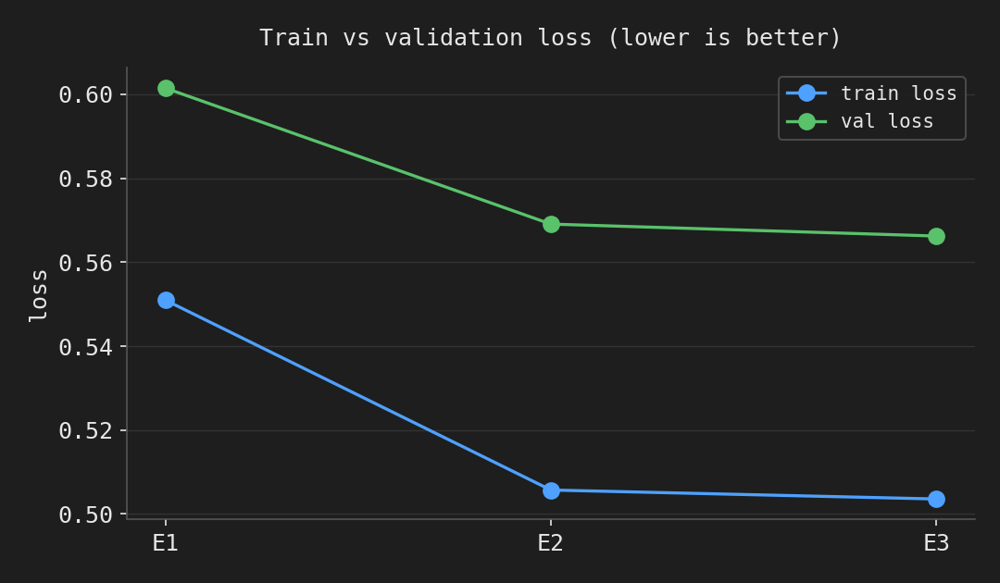
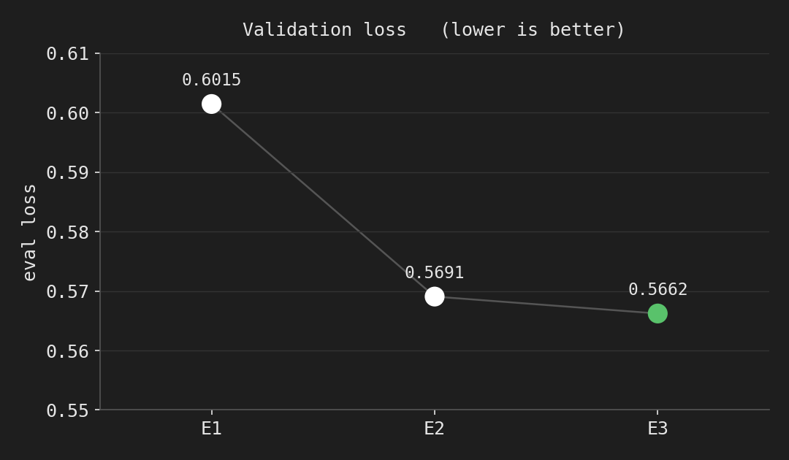
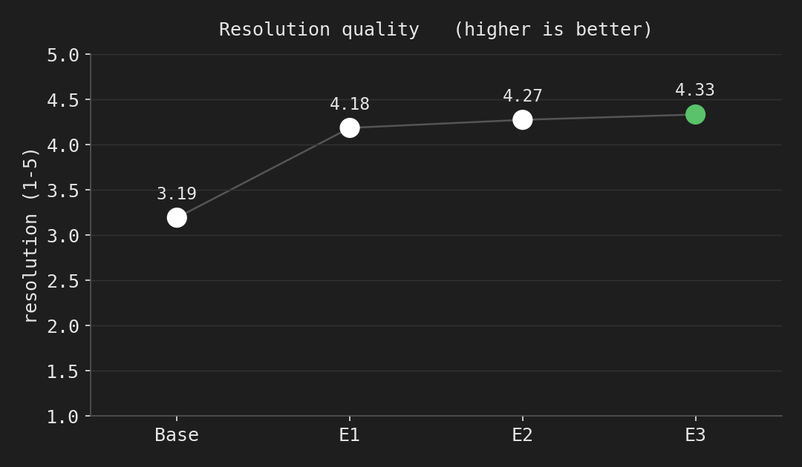
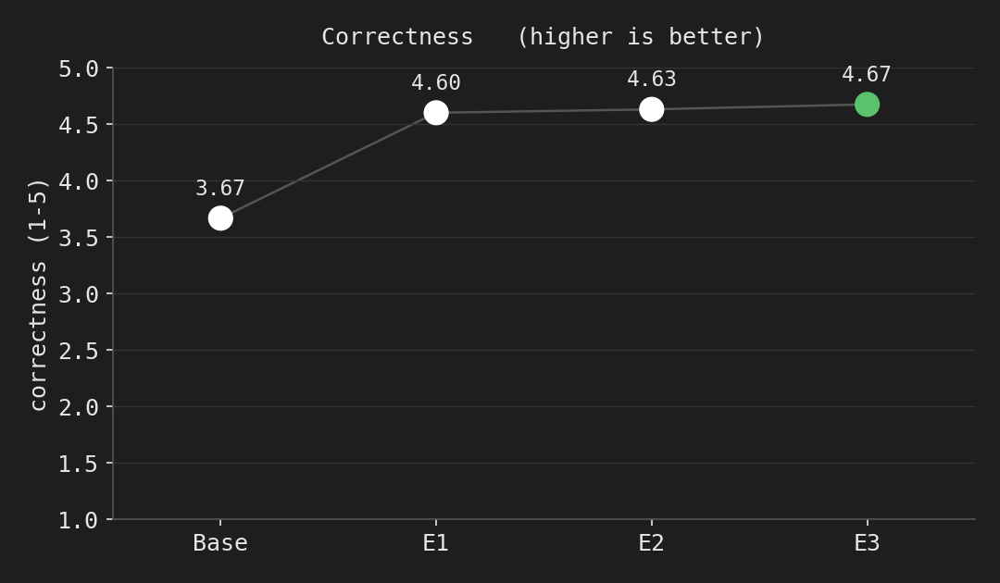
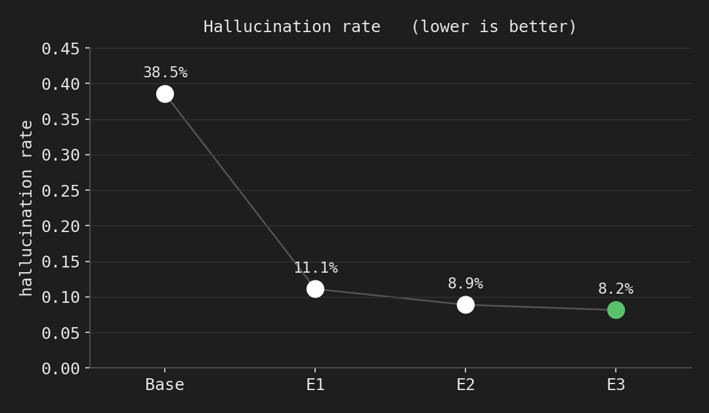
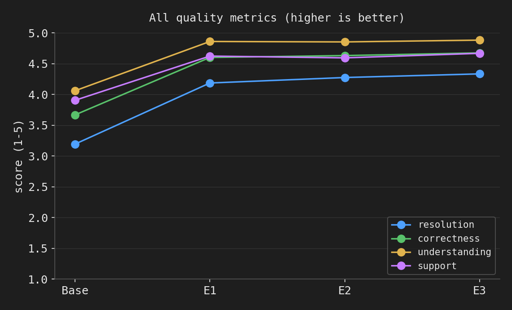
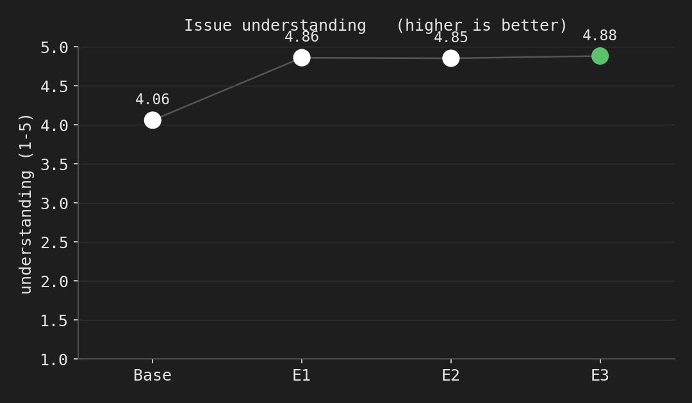
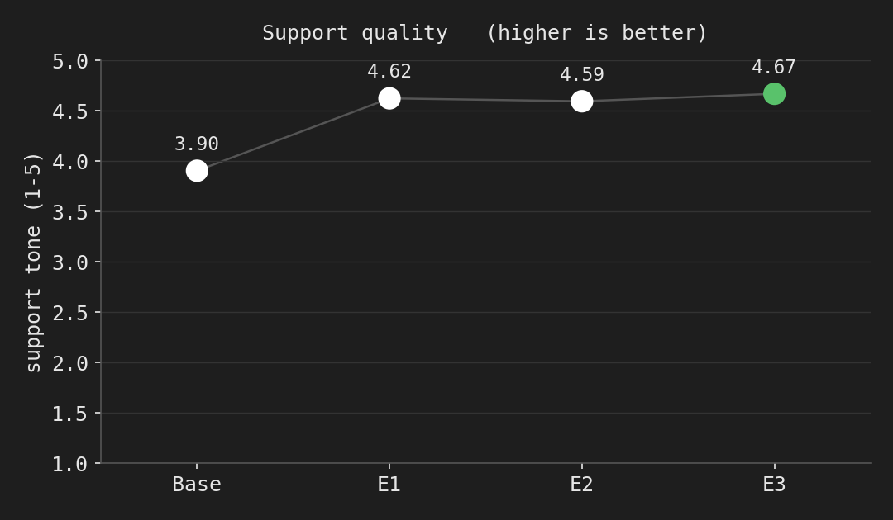

# Fine-tuning results — `qwen3-1.7b-lora`

Task 2 (fine-tuning) + Task 3 (checkpoint selection) results for the Bitext
customer-support SLM. Base model **Qwen/Qwen3-1.7B**, method **LoRA (fp16)**,
compute **one Kaggle T4**.

**Headline:** fine-tuning lifts judge-rated **resolution 3.19 → 4.33 (+1.14)** and
**correctness 3.67 → 4.67 (+1.01)** on a 1–5 scale, and cuts the **hallucination
rate from 38.5% → 8.2%**, on a held-out 135-item benchmark the model never trained on.
**Epoch 3 is the selected checkpoint** (best on every metric *and* best val loss).

> These are **selection** numbers — fp16, on the *validation* benchmark — used to
> pick the checkpoint. The graded base-vs-tuned claim is produced next at serving
> fidelity (Q4_K_M via Ollama) on the untouched **test** split. See *Caveats*.

---

## Folder contents

```
finetuning/results/
├── README.md                     # this report
├── plot_metrics.py               # regenerates every plot from data/
├── data/
│   ├── training_metrics.json     # full loss log_history (from Kaggle run)
│   ├── run_manifest.json         # config + per-epoch checkpoint/eval_loss map
│   └── checkpoint_selection.json # judged metrics for base + each epoch + winner
├── generations/                  # the frozen-benchmark answers that were judged
│   ├── base_fp16.jsonl           # base, no adapter (135)
│   ├── epoch_1.jsonl             # (135)
│   ├── epoch_2.jsonl             # (135)
│   └── epoch_3.jsonl             # (135)  <- selected
└── plots/
    ├── resolution_quality.png    ├── hallucination_rate.png
    ├── correctness.png           ├── eval_loss.png
    ├── issue_understanding.png   ├── quality_combined.png
    ├── support_quality.png       └── train_val_loss.png
```

---

## 1. Training configuration

| | |
|---|---|
| Base model | `Qwen/Qwen3-1.7B` (bf16 checkpoint, trained in fp16 on T4) |
| Method | LoRA — r=16, α=32, dropout=0.05, targets q,k,v,o,gate,up,down |
| Trainable params | 17,432,576 / 2,049,172,480 = **0.85%** |
| Max seq len | 1024 (longest example ~660 tok → 0 truncated) |
| Effective batch | 32 (per-device 8 × grad-accum 4) |
| LR / schedule | 2e-4, cosine, 3% warmup |
| Epochs | 3 (early-stopping patience 2 as a cap; never fired — see below) |
| Loss | completion-only (prompt tokens masked) |
| Prompt contract | frozen `common/prompting.py` — identical at train/eval/serve |
| Compute | 1× Kaggle T4, ~497 min wall |

Full rationale for each choice is in `../README.md` and the project write-up.

## 2. Training curves

Train loss keeps falling; **validation loss flattens after epoch 2** — the
improvement decays from **−0.032** (E1→E2) to **−0.003** (E2→E3). That plateau is
what justified capping at 3 epochs, and the slight train/val divergence at E3 is
the first hint of overfitting on this templated data.

| epoch | train loss | **val loss** |
|---|---|---|
| 1 | 0.551 | 0.6015 |
| 2 | 0.506 | 0.5691 |
| 3 | 0.504 | **0.5662** (best) |




## 3. Checkpoint selection (Tier-2, task-metric)

**Why this step exists.** Val loss only says *when* to stop; it doesn't say which
checkpoint gives the best *answers*. So every epoch's adapter (plus the untuned
base) generates the frozen 135-item benchmark, and **Claude Opus 5** judges each
answer on a structured v2 rubric: issue-understanding, correctness, resolution
quality, support tone (1–5) and a hallucination flag. We rank by
**resolution → correctness → (low) hallucination → (low) val loss**.

**Why fp16 here (not Q4).** Selection is a *ranking* among adapters, which is robust
to quantization; doing it in fp16 is nearly free (weights already resident post-train)
and the matched `base_fp16` reference makes each Δ reflect fine-tuning only, not an
fp16-vs-Q4 artifact. The *graded* comparison is done at Q4_K_M/Ollama fidelity (next).

### Results (Opus-5 v2 judge, 135-item val benchmark)

| model | resolution | correctness | understanding | support | halluc. rate | val loss |
|---|---|---|---|---|---|---|
| **base_fp16** | 3.193 | 3.667 | 4.059 | 3.904 | **38.5%** | — |
| epoch 1 | 4.185 `+0.99` | 4.600 `+0.93` | 4.859 | 4.622 | 11.1% `−0.27` | 0.6015 |
| epoch 2 | 4.274 `+1.08` | 4.630 `+0.96` | 4.852 | 4.593 | 8.9% `−0.30` | 0.5691 |
| **epoch 3** ✅ | **4.333 `+1.14`** | **4.674 `+1.01`** | **4.881** | **4.667** | **8.2% `−0.30`** | **0.5662** |








### Selected: **epoch 3** (`checkpoint-2361` = `best_adapter`)

Epoch 3 is an unambiguous pick — it wins **every** quality metric, has the **lowest**
hallucination rate, *and* the lowest val loss. There is no metric trade-off and no
near-tie, so no Q4 tie-break was needed. (The extra epoch's faint overfitting on loss
did **not** hurt task quality.)

## 4. What to read from this

- **The jump is base → E1.** One epoch already fixes most of the gap (resolution
  +0.99, hallucination −27 pts). Later epochs add small, consistent gains — the
  classic diminishing-returns shape.
- **Hallucination is the standout.** Base Qwen3-1.7B invents unsupported specifics on
  ~38% of support answers; the tuned model on ~8%. For a support assistant that's the
  most consequential axis, and it's the cleanest evidence the fine-tune "took".
- **Understanding barely moves** (4.06 → 4.88): the base already parses the request;
  fine-tuning mainly improves *what it does* with that understanding (resolution,
  correctness, tone) and *how much it makes up*.

## 5. Caveats (kept explicit)

- These are **selection** metrics: **fp16**, on the **validation** benchmark. They
  choose the checkpoint; they are **not** the headline claim.
- The graded, honest **base-vs-tuned** comparison is produced next at **serving
  fidelity** (both models Q4_K_M via Ollama) on the **untouched test split** — the
  same artifact HighLevel will re-run on their internal held-out set.
- `save_total_limit` pruned the epoch-1 adapter weights (its 135 generations survive,
  so it was still fully *judged*). Epoch-2 and epoch-3 (the winner) adapters are on hand.

## 6. Reproduce

```bash
# 1. Kaggle run produced outputs/{training_metrics,run_manifest}.json,
#    base_fp16 + epoch_{1,2,3}/generations.jsonl  (see finetuning/README.md)
# 2. Judge + select (local, needs ANTHROPIC_API_KEY + ANTHROPIC_WORKSPACE_ID):
python finetuning/select_checkpoint.py --outputs <downloaded_outputs_dir> --prompt-version v2
# 3. Regenerate these plots:
/usr/local/bin/python3 finetuning/results/plot_metrics.py
```

## 7. Next — Task 4 (serving)

Merge the epoch-3 adapter → GGUF → **Q4_K_M** → Ollama (Modelfile reproducing the
Qwen3 no-think template); re-baseline the base through the same pipeline; run the
**final base-vs-tuned on the untouched test split** (both Q4_K_M/Ollama, judge v2);
then expose an HTTP API and report latency/throughput.
