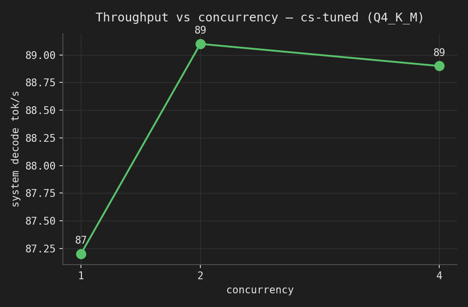

# Serving — self-hosted HTTP API (Task 4)

The fine-tuned model served behind an HTTP API on local hardware, with a
latency/throughput benchmark.

## How it's served

```
client ──POST /chat {message}──▶ FastAPI wrapper (serving/api/app.py)
                                     │  applies the FROZEN contract:
                                     │   system prompt + no-think template + greedy/seed
                                     ▼
                                 Ollama  (http://localhost:11434)
                                     ▼
                                 cs-tuned  = Qwen3-1.7B + ep3 LoRA, merged, Q4_K_M GGUF
```

- **Runtime:** Ollama (llama.cpp) serving a **Q4_K_M GGUF** — good fit for CPU/Metal
  self-hosting, tiny footprint (~1 GB), no GPU server required.
- **Two models, one Modelfile:** `cs-base` and `cs-tuned` are built from GGUFs that
  went through the *identical* convert+quantize pipeline and share one **custom template
  that reproduces the training no-think format** (empty `<think></think>`), so
  train==serve and base==tuned. Template lives in `template.txt` (single source).
- **Thin API layer:** the FastAPI wrapper bakes the prompt contract server-side, so a
  caller only sends the raw customer message. (Ollama's native API at `:11434` also works
  directly — see below — but then the caller must supply the system prompt + options.)

## Build & run

```bash
# 1. Build the Ollama models from the Q4_K_M GGUFs (produced by the Kaggle gguf kernel)
./serving/build_ollama.sh <dir_with_base_and_tuned_gguf>      # -> creates cs-base, cs-tuned

# 2. Run the API (isolated venv keeps your global env clean)
python3 -m venv .venv && . .venv/bin/activate
pip install -r serving/api/requirements.txt
MODEL_TAG=cs-tuned BASE_TAG=cs-base uvicorn app:app --app-dir serving/api --host 0.0.0.0 --port 8000
```

### Endpoints

```bash
curl localhost:8000/health
# {"status":"ok","model":"cs-tuned", ...}

curl -X POST localhost:8000/chat -H 'content-type: application/json' \
     -d '{"message":"I was charged twice for order 8842, please help"}'
# {"response":"I'm sorry to hear ...","model":"cs-tuned",
#  "timing":{"decode_tokens_per_s":93,"output_tokens":78,"total_ms":2002, ...}}

curl -X POST localhost:8000/compare -H 'content-type: application/json' \
     -d '{"message":"how long does standard shipping take?"}'
# {"base":{...}, "tuned":{...}}   # side-by-side, used in the demo
```

**Raw Ollama alternative** (no wrapper):
```bash
curl localhost:11434/api/chat -d '{"model":"cs-tuned","think":false,
  "options":{"temperature":0,"seed":42,"num_predict":512},
  "messages":[{"role":"system","content":"<SYSTEM_PROMPT>"},
              {"role":"user","content":"..."}]}'
```

## Latency / throughput

Measured on a local Mac (Apple **Metal**), `cs-tuned` Q4_K_M, n=40 prompts sampled
across the test split. Numbers come from **Ollama's own duration fields**
(`eval_count/eval_duration` etc.), so they are well-defined, not wall-clock guesses.
Reproduce: `python serving/bench/benchmark.py --model cs-tuned --n 40 --concurrency 1 2 4`.

**Single-stream** (one request at a time):

| metric | value |
|---|---|
| latency p50 / p95 | **1.23 s** / 2.62 s (full reply) |
| latency mean | 1.49 s |
| decode throughput | **94 tok/s** |
| prefill throughput | ~2,900 tok/s |
| mean output length | 131 tokens |

**Throughput vs concurrency** (same 40 prompts, N workers):

| concurrency | req/s | system decode tok/s |
|---|---|---|
| 1 | 0.67 | 87 |
| 2 | 0.68 | 89 |
| 4 | 0.68 | 89 |



**Reading it:** throughput is **flat across concurrency** — with default settings Ollama
serializes requests, so a single 1.7B model on one Metal device is decode-bound (~88 tok/s
aggregate regardless of client concurrency). Prefill is ~30× faster than decode (prompt
processing is batched; token generation is sequential), so latency is dominated by output
length. To raise throughput you'd set `OLLAMA_NUM_PARALLEL>1` (in-flight batching) or scale
horizontally; gains are bounded by the single device's memory bandwidth.

## What I'd revisit for production

- **Streaming** (`stream=true`) for time-to-first-token UX instead of full-response latency.
- **Batching / `OLLAMA_NUM_PARALLEL`** or a batching server (vLLM/TGI) on a GPU for real
  concurrent throughput; here Ollama/llama.cpp was chosen for zero-cost self-hosting.
- **De-templating** the `{{placeholder}}` outputs (fill real values, or train on cleaned data).
- **Auth, rate limiting, timeouts, request logging** on the API layer.

## Folder contents

```
serving/
├── README.md
├── template.txt          # the shared no-think TEMPLATE (train==serve)
├── build_ollama.sh       # build cs-base + cs-tuned from the GGUFs
├── api/
│   ├── app.py            # FastAPI: /health, /chat, /compare
│   └── requirements.txt
└── bench/
    ├── benchmark.py      # latency/throughput via Ollama duration fields
    ├── results.md        # the numbers above
    └── throughput_vs_concurrency.png
```
